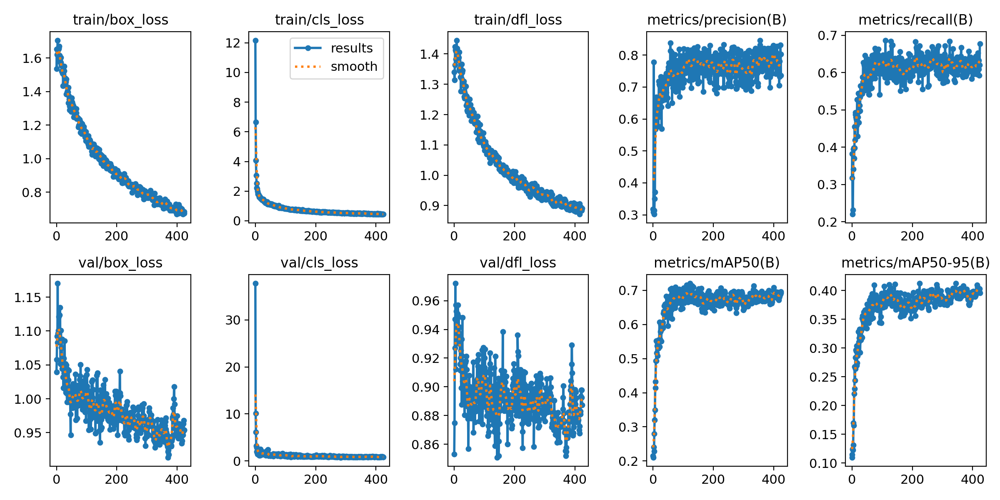

# BattleBitDL (BattleBit Deep learning)
Attempts to mark/identify objects(players) both enemies and teammates using YoloV8's object detection on a custom dataset.

# How to use
- Please consult [Requirements](#Requirements) first.
- Read all TODO comments in Program.cs (Replace ModelPath to a absolute path!)
- Attempt to run (Running in a debug state will decrease performance exponentially!)

# Model
The model provided in onnx format is a YoloV8 small model trained on 1.25k images at 1920x1088 for about 425~ epochs (Original's are 1920x1080).

# Requirements
- Windows Only
- Nvidia GPU
- CUDA 11.X, cuDNN 11.X, zlib 1.2.3 installed / linked to path
- Knowledge

# NuGet Dependencies
- [YoloV8.NET](https://github.com/sstainba/Yolov8.Net/)
- [Emgu.CV](https://github.com/emgucv/emgucv)
  - Emgu.CV.Bitmap
  - Emgu.CV.Runtime.Windows
- Microsoft.ML.OnnxRuntime.GPU
- System.Drawing.common